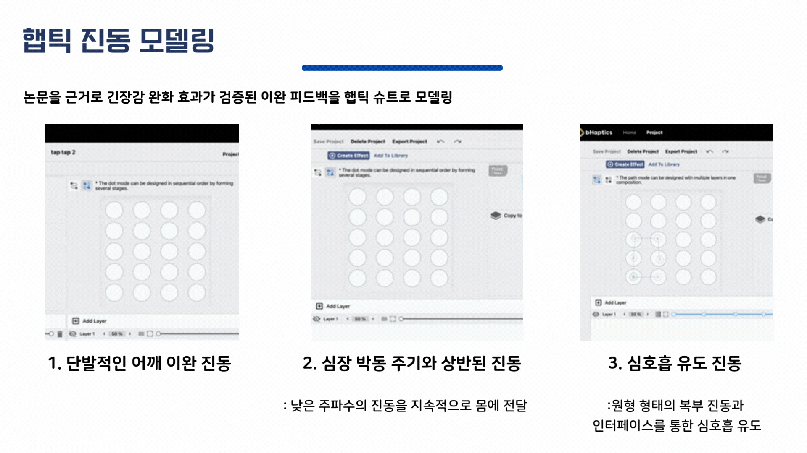

<div align="center">

# ⌚ Calmpilot

  

> *Real-time biometric pipeline for adaptive haptic feedback in VR*. *VR 적응형 햅틱을 위한 실시간 생체 데이터 파이프라인*  
> User study: 3 haptic patterns × 10 participants, HR time-series analysis. *사용자 연구: 3가지 햅틱 패턴 × 10명, 데이터 분석.*

</div>

<br>

📊 Calmpilot is a **user study investigating how haptic feedback patterns affect physiological arousal in VR**. The system uses real-time heart rate data from wearables to automatically trigger calming haptics when arousal exceeds thresholds. We compared three patterns—slow vibration, breathing guidance, and butterfly hug—in a controlled VR public speaking experiment (N=10). Breathing-guided haptics achieved the most sustained heart rate reduction (avg. -4 BPM).

<br>

📊 Calmpilot은 **VR 프로그램을 활용한 노출 치료에서 햅틱 피드백 패턴이 불안 감소에 미치는 영향을 연구한 프로젝트**입니다. 웨어러블 디바이스의 실시간 심박수 데이터를 활용해 임계값을 초과하면 자동으로 이완 햅틱 패턴을 트리거합니다. 임상적으로 검증된 세 가지 햅틱 패턴—느린 진동, 심호흡 유도, 나비포옹법—을 설계하고 VR 발표 환경에서 통제된 실험을 통해 효과를 검증했습니다. 분석 결과 심호흡 유도 햅틱이 가장 유의미하고 지속적인 심박수 감소(평균 4 BPM 감소)를 보였습니다.

---

<div align="center">

## 📋 Table of Contents

1. [🎯 Overview](#-overview)
2. [📚 Research Background](#-research-background)
3. [⚙️ System Architecture](#️-system-architecture)
4. [🔬 Experiment Design](#-experiment-design)
5. [📊 Data Analysis](#-data-analysis)
6. [🏆 Publications & Awards](#-publications--awards)

---

</div>

<div align="center">
  
## 🎯 Overview

### 📖 Introduce

**Project**: Calmpilot  
**Type**: Academic Research 
**Duration**: 2023.09 ~ 2024.02  
**Advisor**: Prof. Seokhee Jeon (KHU Haptics and Virtual Reality Lab)

  |    |   |  

<br>

### 👥 Team

| Position | Role | Name | Affiliation |
|:--|:--|:--|:--|
| 💻 Research | First Author, System Design & Data Pipeline | [Jaehyun Byun](https://github.com/BynPlay) | Kyung Hee Univ.<br>Computer Science |
| 💻 Research | Co-Author, Experiment Support | [Jihye Ryu](https://github.com/Domwis-IR) | Kyung Hee Univ.<br>Software Convergence |
| 💻 Research | Co-Author, Data Analysis | [Hyeon Roh](https://github.com/YesHyeon) | Kyung Hee Univ.<br>Industrial & Management Engineering |
| 🎓 Advisor | Academic Advisor | [Prof. Seokhee Jeon](http://haptics.khu.ac.kr/) |  Kyung Hee Univ.<br>Haptics and Virtual Reality Lab | 

</div>

---

<br>

## 📚 Research Background

### 📖 Problem Statement

Social anxiety disorder causes excessive fear in social interactions—**4 out of 10 university students** experience these symptoms. While exposure therapy with cognitive feedback shows superior outcomes, two barriers exist: (1) CBT specialists require 1+ years of training, and (2) real-time third-party intervention is nearly impossible during social interactions.

사회 공포증은 사회적 상호작용에서 과도한 불안을 유발하며, **대학생 10명 중 4명**이 이를 경험합니다. 노출 요법에 인지적 피드백을 병합하면 효과가 우수하지만 두 가지 장벽이 존재합니다: (1) 인지행동치료 전문가 양성에 최소 1년 이상 소요, (2) 사회적 상호작용 중에는 제3자의 실시간 개입이 어려움.

### 🔍 Prior Work & Insight

This research designed a biometric-driven automatic haptic feedback pipeline (Galaxy Watch → WebSocket → Unity → bhaptics) for VR exposure therapy, and compared which haptic pattern most effectively reduces tension through a controlled user study.

본 연구는 VR 노출 치료 중 생체 신호 기반 **자동화된 햅틱 피드백 파이프라인(Galaxy Watch → WebSocket → Unity → bhaptics)** 을 설계하고, 통제된 사용자 연구를 통해 어떤 햅틱 패턴이 긴장 완화에 가장 효과적인지 비교했습니다.

| Study | Key Finding | Our Pattern |
|:--|:--|:--|
| **Azevedo et al. (2017)** | Vibration 20% slower than resting HR reduced anxiety | Slow vibration |
| **Haynes et al. (2022)** | Breathing-guided haptic most effective for tension relief | Breathing guidance |
| **Butterfly Hug (EMDR)** | Alternating shoulder taps used in trauma therapy | Butterfly hug |

---

<br>

## ⚙️ System Architecture

### 🔧 Cross-Platform Data Pipeline

이종 플랫폼 데이터 파이프라인

```
┌──────────────────┐    ┌──────────────────┐    ┌──────────────────┐    ┌──────────────────┐
│  Wearable Layer  │    │  Streaming Layer │    │   Client Layer   │    │   Output Layer   │
│  Galaxy Watch 6  │    │     HypeRate     │    │   Unity Engine   │    │  bhaptics Suit   │
├──────────────────┤    ├──────────────────┤    ├──────────────────┤    ├──────────────────┤
│ • HR Sensor      │    │ • WebSocket API  │    │ • Data Reception │    │ • 40 Vibration   │
│ • 1Hz Sampling   │───→│ • Real-time      │───→│ • Threshold      │───→│   Motors         │
│ • BPM Output     │    │   Relay          │    │   Detection      │    │ • Pattern Play   │
│                  │    │ • Multi-device   │    │ • CSV Logging    │    │ • Haptic Design  │
└──────────────────┘    │   Support        │    │ • Trigger Logic  │    └──────────────────┘
                        └──────────────────┘    └──────────────────┘
```

### 📡 Real-time Heart Rate Streaming

실시간 심박수 스트리밍

| Component | Implementation |
|:--|:--|
| **Sensor** | Galaxy Watch 6 optical HR sensor, 1-second interval sampling<br>갤럭시 워치 6 광학 심박 센서, 1초 간격 샘플링 |
| **Middleware** | HypeRate WebSocket relay—unified API for diverse wearables<br>HypeRate WebSocket 중계—다양한 웨어러블 통합 API |
| **Reception** | Unity HypeRate SDK, real-time BPM variable access<br>Unity HypeRate SDK, 실시간 BPM 변수 접근 |
| **Threshold** | HR ≥ 115 BPM triggers haptic feedback (pilot test max: 130, normal: 60-100)<br>심박수 115 이상 시 햅틱 피드백 트리거 (파일럿 테스트 최대: 130, 정상: 60-100) |

### 📝 Timestamp-Synchronized Logging System

타임스탬프 동기화 로깅 시스템

```csharp
// CSV Logging with StreamWriter
public class BiometricLogger : MonoBehaviour
{
    private StreamWriter writer;
    private string filepath;
    
    void Start()
    {
        filepath = $"Data/HR_{participantID}_{DateTime.Now:yyyyMMdd_HHmmss}.csv";
        writer = new StreamWriter(filepath);
        writer.WriteLine("Timestamp,HeartRate,FeedbackType,ScenePhase");
    }
    
    void OnHeartRateReceived(int bpm)
    {
        string timestamp = DateTime.Now.ToString("yyyy-MM-dd HH:mm:ss.fff");
        string feedbackType = currentFeedback.ToString();
        string phase = currentScene.ToString();
        
        writer.WriteLine($"{timestamp},{bpm},{feedbackType},{phase}");
        writer.Flush();
    }
}
```
---

## 🎨 Haptic Feedback Design

<div align="center">
  
</div>

### 🎛️ Three Clinically-Grounded Patterns

임상적으로 검증된 세 가지 패턴

Patterns were designed using **bhaptics Designer**—a web-based haptic authoring tool for TactSuit's 40 vibration motors.

패턴은 **bhaptics Designer**를 사용해 설계했습니다—TactSuit의 40개 진동 모터를 위한 웹 기반 햅틱 저작 도구입니다.

| Pattern | Clinical Basis | Implementation |
|:--|:--|:--|
| **🫀 Slow Vibration** | Azevedo (2017): Sub-heartbeat rhythm induces physiological entrainment<br>심박 이하 리듬이 생리적 동조 유도 | 10-second continuous vibration at 20% below resting HR frequency<br>안정 시 심박수보다 20% 느린 주파수로 10초간 지속 진동 |
| **🌬️ Breathing Guide** | Haynes (2022): Most effective for tension relief<br>긴장 완화에 가장 효과적 | Abdominal-centered expanding/contracting circular vibration pattern<br>복부 중앙 기준 확장/수축하는 원형 진동 패턴 |
| **🦋 Butterfly Hug** | EMDR-based trauma therapy technique<br>EMDR 기반 외상 치료 기법 | Alternating single taps on left/right shoulders<br>양쪽 어깨를 번갈아 단발적으로 두드림 |

---

<br>

## 🔬 Experiment Design

### 🎭 VRET Environment Design

<div align="center">
  
</div>

The VR public speaking simulation was built in **Unity Engine** with psychological pressure elements:

VR 발표 시뮬레이션은 **Unity Engine**으로 심리적 압박 요소를 포함하여 구현했습니다:

| Element | Implementation | Purpose |
|:--|:--|:--|
| **Audience NPCs** | Animator Controller with Idle/Clapping/Questioning states<br>Idle/Clapping/Questioning 상태를 가진 Animator Controller | Social pressure simulation<br>사회적 압박 시뮬레이션 |
| **Event Sequences** | Timeline + Playable Director for host, warnings, disruptions<br>사회자, 경고, 돌발 상황을 위한 Timeline + Playable Director | Controlled stressor delivery<br>통제된 스트레스 요인 전달 |
| **Interactions** | Ray Interactor for PPT control, script checking<br>PPT 제어, 대본 확인을 위한 Ray Interactor | Realistic task engagement<br>현실적인 과제 몰입 |
| **UI Elements** | World Space Canvas for recording indicator, timer<br>녹화 표시, 타이머를 위한 World Space Canvas | Performance pressure<br>수행 압박 |
| **Scene Transitions** | Async Scene Loading with fade effects<br>페이드 효과가 적용된 비동기 씬 로딩 | Immersion maintenance<br>몰입 유지 |

<br>

### 📋 Experiment Protocol

| Variable | Definition |
|:--|:--|
| **Control** | Presentation content & interactions (constant) |
| **Independent** | Haptic type: None / Slow / Breathing / Butterfly |
| **Dependent** | Heart rate change (BPM Δ) |

**Participants**: N=10 (5M/5F), ages 20-25, university students

**Procedure**: Pre-survey → Equipment fitting (VR + Watch + bhaptics) → Waiting room → Presentation → Post-SUS
- 4 trials per participant (within-subjects, counterbalanced)
---

<br>

## 📊 Data Analysis

데이터 분석

### 🔄 Data Preprocessing Pipeline

데이터 전처리 파이프라인

```python
import pandas as pd
import numpy as np

def preprocess_biometric_data(filepath):
    # Load raw CSV
    df = pd.read_csv(filepath)
    
    # Handle missing values
    df['HeartRate'] = df['HeartRate'].fillna(df['HeartRate'].median())
    
    # Encode categorical feedback types
    feedback_map = {
        'None': 0, 'SlowVibration': 1, 
        'BreathingGuide': 2, 'ButterflyHug': 3
    }
    df['FeedbackEncoded'] = df['FeedbackType'].map(feedback_map)
    
    # Validate timestamp uniformity
    df['Timestamp'] = pd.to_datetime(df['Timestamp'])
    df['TimeDelta'] = df['Timestamp'].diff().dt.total_seconds()
    
    return df
```

<br>

### 📈 Statistical Analysis Results

통계 분석 결과

<div align="center">

| Condition | Mean HR (BPM) | Δ from Baseline |
|:--|:--:|:--:|
| **No Feedback** 피드백 없음 | 111 | — |
| **With Feedback** 피드백 있음 | 107 | **-4 BPM** |

</div>

<br>

**Key Findings | 주요 발견**:

| Pattern | Immediacy<br>즉각성 | Duration<br>지속성 | Effectiveness<br>효과성 |
|:--|:--:|:--:|:--:|
| 🌬️ **Breathing Guide** 심호흡 유도 | ⭐⭐⭐ Immediate<br>즉각적 | ⭐⭐⭐ Longest<br>가장 김 | **Most Effective**<br>**가장 효과적** |
| 🫀 **Slow Vibration** 느린 진동 | ⭐⭐⭐ Immediate<br>즉각적 | ⭐⭐ Moderate<br>보통 | Effective<br>효과적 |
| 🦋 **Butterfly Hug** 나비포옹법 | ⭐ Delayed (2-3 reps)<br>지연 (2-3회 반복 후) | ⭐ Short<br>짧음 | Least Effective<br>가장 낮음 |

<br>

### 📉 Time-Series Analysis

시계열 분석

```python
import seaborn as sns
import matplotlib.pyplot as plt

def analyze_feedback_effect(df, feedback_event_time):
    # Extract pre/post feedback windows
    window_before = df[df['Timestamp'] < feedback_event_time].tail(30)
    window_after = df[df['Timestamp'] >= feedback_event_time].head(60)
    
    # Calculate HR change trajectory
    pre_mean = window_before['HeartRate'].mean()
    post_trajectory = window_after['HeartRate'].rolling(5).mean()
    
    # Visualize
    plt.figure(figsize=(12, 6))
    plt.axvline(x=0, color='red', linestyle='--', label='Feedback Trigger')
    plt.plot(range(-30, 60), 
             pd.concat([window_before['HeartRate'], 
                       window_after['HeartRate']]).values)
    plt.xlabel('Time (seconds from trigger)')
    plt.ylabel('Heart Rate (BPM)')
    plt.title('HR Response to Haptic Feedback')
    plt.legend()
    
    return post_trajectory
```

**Observations | 관찰 결과**:
- Feedback-triggered group showed HR spike to 120-130 BPM upon waiting room entry<br>피드백이 발생한 그룹은 대기실 입장 시 심박수가 120-130 BPM으로 급상승
- Breathing guide and slow vibration showed **immediate** HR reduction post-trigger<br>심호흡 유도와 느린 진동은 트리거 후 **즉각적인** 심박수 감소를 보임
- Butterfly hug required **2-3 repetitions** before measurable effect<br>나비포옹법은 측정 가능한 효과가 나타나기까지 **2-3회 반복** 필요

<br>

### 📝 Usability Evaluation

사용성 평가

| Metric | Score | Interpretation |
|:--|:--:|:--|
| **SUS Score** | 78.95 / 100 | Good usability<br>양호한 사용성 |
| **Perceived Effectiveness** 인지된 효과성 | 4.0 / 5.0 | Positive user perception of haptic calming<br>햅틱 이완 효과에 대한 긍정적 인식 |

---

<br>

## 🏆 Publications & Awards

출판 및 수상

<div align="center">

### 📄 Publication

**[Designing Haptic Feedback for Social Phobia Improvement and VRET Environment for Data Analysis](https://www.dbpia.co.kr/journal/articleDetail?nodeId=NODE11862533)**

*Korea Computer Congress (KCC) 2024*  
Jaehyun Byun, Jihye Ryu, Seokhee Jeon

<br>

### 🥇 Awards

| Award | Event | Year |
|:--|:--|:--|
| 🏆 **학부생 우수논문상** | Korea Computer Congress (KCC) 2024 | 2024 |
| 🌏 **Honored Partner Startup Exhibition** | Vietnam Mobile Summit 2024 | 2024 |

</div>

---

<br>

## 📚 References

1. 권석만. 현대 이상심리학. 서울 학지사. 2012
2. Azevedo, R.T., et al. The calming effect of a new wearable device during the anticipation of public speech. Sci Rep 7, 2285. 2017
3. Haynes AC, et al. A calming hug: Design and validation of a tactile aid to ease anxiety. PLoS One. 2022
4. Deusdado & Antunes. VR rehabilitation with bHaptics TactSuit. 2023
5. Heimberg, R.G. Cognitive-behavioral therapy for social anxiety disorder. Biological Psychiatry, 51, 101-108. 2002

---

<div align="center">

### 📬 Contact

For questions about this research, please contact:  
**Jaehyun Byun** — bjh1750@khu.ac.kr

</div>
